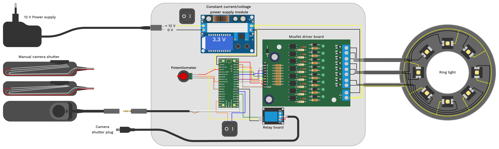

# MLIC-tools

## Overview
This repository should provide tools that can be used for capturing and processing Multi Light Image Collections (MLICs). My poster, presented at the annual meeting of the Palaeontological Association in Cambridge 2023, provides a graphical overview of the Multi Light Imaging workflow with regards to compression fossils. It is now openly available at Zenodo as a PDF file under the following persistent link [https://doi.org/10.5281/zenodo.8381473](https://doi.org/10.5281/zenodo.8381473).

## Capturing
Captuing ideally happens with a fixed lighting setup. This way it is not necessary to image reference spheres for each image collection. The light directions are stored in text files (light point files) – there are different conventions, depending on the software to use.
The light point files can easily be retrieved through the GUI version of [Relight](https://github.com/cnr-isti-vclab/relight).

I constructed a ring light with 8 LED lamps that can be controlled individually using a Raspberry Pi Pico, which also receives and sends signals through camera trigger cables. This way, the entire process of lighting and camera captures can be automated and included in commercially available focus-stacking and panoramic capturing devices.
The entire setup can be fixed onto the hot shoe of a camera (where usually the flash goes). The image below shows the wiring and the components used in this setup. The total cost of components is about 100 Euros (excluding shipping and tools).

The micropython code [mlic_ringlight.py](mlic_ringlight.py) is developed to be used with a DSLR. For mirrorless cameras, the timings can be set faster.

### 3D printable parts
- Ring light housing for a Laowa 25 mm 2.5x objective
- Hot shoe adapter for a Nikon D7200 DSLR

## Processing
For processing of the MLICs the GUI or command line version of [Relight](https://github.com/cnr-isti-vclab/relight) can be used. For combining MLIC capturing with focus stacking, the command line version can be called from a Bash or Python script.

## Normal map transformations
After having produced a normal map, you may notice that the way how the normals are coded is not desirable. For example you used two different programs to produce the normal maps and one of your normal maps is "flipped". In another case, you may have forgotten to rotate the base images before producing the normal map. Gladly, simple 90 degree step rotations and flips of the normals can be done using basic manipulations of the color channels. These are the operations as [Imagemagick](https://imagemagick.org/) commands. For this, I looked up the basic transformations from [this](https://robonobodojo.wordpress.com/2015/11/22/transforming-normal-maps/) blog post from Andy Davis ([https://robonobodojo.wordpress.com](https://robonobodojo.wordpress.com)).

| Operation | Command |
| --- | --- |
| Horizontal flip | `convert input.png -channel R -negate output.png` |
| Vertical flip | `convert input.png -channel G -negate output.png` |
| Clockwise 90 degree rotation | `convert input.png -separate -swap 0,1 -combine -channel R -negate output.png` |
| Counter clockwise 90 degree rotation| `convert input.png -separate -swap 0,1 -combine -channel G -negate output.png` |
| 180 degree rotation | `convert input.png -channel R -negate -channel G -negate output.png` |

