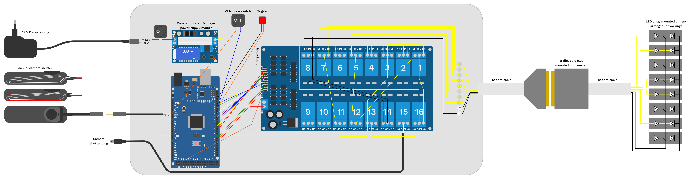
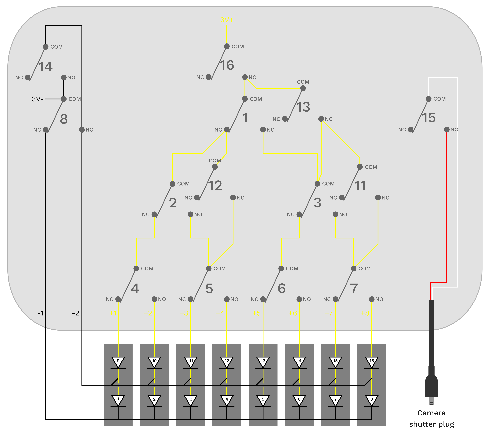

# MLIC-tools

## Overview
This repository should provide tools that can be used for capturing and processing Multi Light Image Collections (MLICs). My poster, presented at the annual meeting of the Palaeontological Association in Cambridge 2023, provides a graphical overview of the Multi Light Imaging workflow with regards to compression fossils. It is now openly available at Zenodo as a PDF file under the following persistent link [https://doi.org/10.5281/zenodo.8381473](https://doi.org/10.5281/zenodo.8381473).

## Capturing
Capturing ideally happens with a fixed lighting setup. This way it is not necessary to image reference spheres for each image collection. The light directions are stored in text files (light point files) – there are different conventions, depending on the software to use.
The light point files can easily be retrieved through the GUI version of [Relight](https://github.com/cnr-isti-vclab/relight).

### Ring light setup (for Laowa 25 mm)
I constructed a ring light with 8 LED lamps that can be controlled individually using a Raspberry Pi Pico, which also receives and sends signals through camera trigger cables. This way, the entire process of lighting and camera captures can be automated and included in commercially available focus-stacking and panoramic capturing devices.
The entire setup can be fixed onto the hot shoe of a camera (where usually the flash goes). The image below shows the wiring and the components used in this setup. The total cost of components is about 100 Euros (excluding shipping and tools).

The micropython code [mlic_ringlight.py](mlic_ringlight.py) is developed to be used with a DSLR. For mirrorless cameras, the timings can be set faster.

### Dome setup (for Laowa 100 mm)
For my Laowa 100 mm macro lens (2x or less magnification) I constrcuted a different setup that resembles more the classical dome setup used in "RTI" imaging setups, as it includes two instead of one ring of lamps (summing up to 16 lights). However, as with the ring light, the lamps are attached to the lens. This means they move with the camera while recording focus stacks. Since the electronic components I used were to bulky to fit into a small housing that could be attached to the camera hotshoe, I separated the controlling elements from the dome with the aid of 12 core cable and made it detachable by interposing a pair of serial port plugs salvaged from discarded devices.

To incorporate 16 lights without buying expensive hardware, I re-used a relay board (16 relays), which I already had from a [previous build](https://doi.org/10.3897/asp.80.e86582), to construct a tree of switches that can controll more lamps than it needs switches. The relay board utilized a 5V logic. Therefore I could not use a Raspberry Pi Pico but had to use an Arduino MEGA (the UNO has to few pins). Interestingly, I could use the relay board as a 5V power supply for the Arduino and did not need an additional power regulator since I could feed the 12V from the wall plug power supply directly to the relay board, allowing the buck boost converter to only supply the LEDs.
To also use the dome for constant (somewhat) diffuse illumination I included some additional switches to connect the branches of the wiring tree. This allowed me to turn on 8 of the 16 LEDs simultaneously, for which I included a physical switch on the housing ("MLI-mode" on or off).

### 3D printable parts
- Ring light housing for a Laowa 25 mm 2.5x objective
- Hot shoe adapter for a Nikon D7200 DSLR

## Processing
For processing of the MLICs the GUI or command line version of [Relight](https://github.com/cnr-isti-vclab/relight) can be used. For combining MLIC capturing with focus stacking, the command line version can be called from a Bash or Python script.

## Normal map transformations
After having produced a normal map, you may notice that the way how the normals are coded is not desirable. For example you used two different programs to produce the normal maps and one of your normal maps is "flipped". In another case, you may have forgotten to rotate the base images before producing the normal map. Gladly, simple 90 degree step rotations and flips of the normals can be done using basic manipulations of the color channels. These are the operations as [Imagemagick](https://imagemagick.org/) commands. For this, I looked up the basic transformations from [this](https://robonobodojo.wordpress.com/2015/11/22/transforming-normal-maps/) blog post from Andy Davis ([https://robonobodojo.wordpress.com](https://robonobodojo.wordpress.com)).

| Operation | Command |
| --- | --- |
| Horizontal flip | `convert input.png -channel R -negate output.png` |
| Vertical flip | `convert input.png -channel G -negate output.png` |
| Clockwise 90 degree rotation | `convert input.png -separate -swap 0,1 -combine -channel R -negate output.png` |
| Counter clockwise 90 degree rotation| `convert input.png -separate -swap 0,1 -combine -channel G -negate output.png` |
| 180 degree rotation | `convert input.png -channel R -negate -channel G -negate output.png` |

